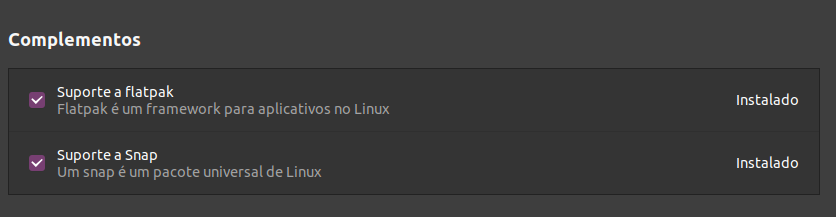

# Configuração Ubuntu 20.04 pós formatação.

As configurações a seguir se trata de uma personalização que costumo fazer para aumentar a minha produtividade e instalar e configurar softwares que costumo usar no dia a dia.

## Atualização do sistema

Processo necessário para a deixar os sistema livre de bugs.

`$ sudo apt update && sudo apt upgrade -y`

## Configuração do sistema

### Compatibilizando o sistema com pacotes Flatpak

Instalando o Flatpak

`$ sudo apt install flatpak`

Adicionando o Flathub como repositório

`$ flatpak remote-add --if-not-exists flathub https://flathub.org/repo/flathub.flatpakrepo`

Adicionando a Gnome Software

`$ sudo apt install gnome-software`

Para adicionar o suporte ao flatpak direto na loja é necessário ir a GNOME Software clica na aba instalados e encontre a aplicação chamada Software.
Agora nos complementos é possivel marcar a opção Suporte a Flatpak

### Ativando a opção de minimizar no icone da Dock

Por padrão não vem habilitado a opção de minimizar o programa clicando no icone da dock.

`$ gsettings set org.gnome.shell.extensions.dash-to-dock click-action 'minimize'`

### Atualizar codecs de midia

`$ sudo apt install ubuntu-restricted-extras`

## Instalação de programas 

### Instalar Unrar

O gerenciador de compactação padrão não consegue lidar com arquivos .rar para isso é necessário instalar o Unrar.

`$ sudo apt install unrar`

### Programas Essenciais

`$ sudo apt install git`

`$ sudo apt install vim`

### Edição de layouts do sistema

Aplicações necessárias para personalizar a interface grafica.

`$ sudo apt install gnome-tweaks`

## Configurar Terminal

Instalando o ZSH.

`$ sudo apt install zsh`

Definindo o ZSH como terminal padrão.

`$ sudo usermod -s /bin/zsh $USER`

Instalar o Oh-my-Zsh.

`$ sh -c "$(curl -fsSL https://raw.githubusercontent.com/robbyrussell/oh-my-zsh/master/tools/install.sh)"`

Instalar o tema Spaceship.

`$ git clone https://github.com/denysdovhan/spaceship-prompt.git "$ZSH_CUSTOM/themes/spaceship-prompt"`

Criando um link simbolico para o tema.

`$ ln -s "$ZSH_CUSTOM/themes/spaceship-prompt/spaceship.zsh-theme" "$ZSH_CUSTOM/themes/spaceship.zsh-theme"`

Editanto o tema escolhido.

`$ vim ~/.zshrc`

Altere a linha do arquivo ZSH_THEME="robbyrussell" para

> ZSH_THEME="spaceship"

Adicione no fim do arquivo

>SPACESHIP_PROMPT_ORDER=(
>
>  &nbsp;&nbsp;user          # Username section
> 
>  &nbsp;&nbsp;dir           # Current directory section
> 
>  &nbsp;&nbsp;host          # Hostname section
> 
>  &nbsp;&nbsp;git           # Git section (git_branch + git_status)
> 
>  &nbsp;&nbsp;hg            # Mercurial section (hg_branch  + hg_status)
> 
>  &nbsp;&nbsp;exec_time     # Execution time
> 
>  &nbsp;&nbsp;line_sep      # Line break
> 
>  &nbsp;&nbsp;vi_mode       # Vi-mode indicator
> 
>  &nbsp;&nbsp;jobs          # Background jobs indicator
> 
>  &nbsp;&nbsp;exit_code     # Exit code section
> 
>  &nbsp;&nbsp;char          # Prompt character
> 
>)
>
>SPACESHIP_USER_SHOW=always
>
>SPACESHIP_PROMPT_ADD_NEWLINE=false
>
>SPACESHIP_CHAR_SUFFIX=" "

Instalando plugins

`$ sh -c "$(curl -fsSL https://raw.githubusercontent.com/zdharma/zinit/master/doc/install.sh)"`

Adicione no arquivo depois da linha ### End of ZInit's installer chunk 

> zinit light zdharma/fast-syntax-highlighting
>
> zinit light zsh-users/zsh-autosuggestions
>
> zinit light zsh-users/zsh-completions

## Instalação das Sdks

NodeJs

`$ wget -qO- https://raw.githubusercontent.com/nvm-sh/nvm/v0.35.3/install.sh | bash`

Adicionar no inicio do arquivo ~/.zshrc

> export NVM_DIR="$([ -z "${XDG_CONFIG_HOME-}" ] && printf %s "${HOME}/.nvm" || printf %s "${XDG_CONFIG_HOME}/nvm")"
[ -s "$NVM_DIR/nvm.sh" ] && \. "$NVM_DIR/nvm.sh" # This loads nvm

`$ nvm nvm 12.10.0`

Java

Versão Corrente

`$ sudo apt-get install default-jdk`

JDK 8

`$ sudo apt-get install openjdk-8-jdk`

Em caso de mais de uma versão do Java instalado é possivel selecionar qual será a padrão com o comando

`$ sudo update-alternatives --config java`

## Instalar Programas .deb

Synapse

`$ sudo apt install synapse`

Docker 

`$ sudo curl -sSL https://get.docker.com | sh`

Insominia

`$ sudo apt-get install insomnia`

## Instalar Programas Snaps

Visual Studio Code.

`$ sudo snap install code --classic`

Drawio

`$ sudo snap install drawio`

Android Studio

`$ sudo snap install android-studio --classic`

WPS

`$ sudo snap install wps-office-all-lang-no-internet`